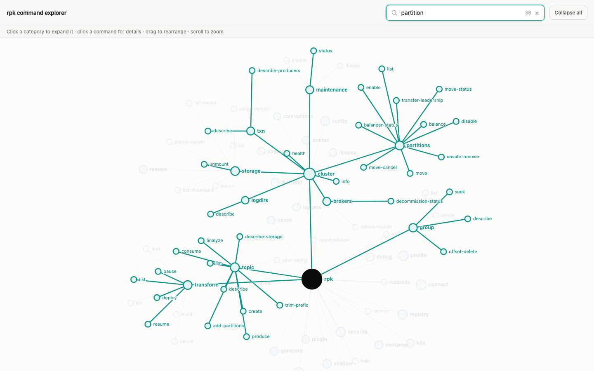

# rpk command explorer

An interactive, force-directed graph of the `rpk` (Redpanda CLI) command tree. Expand categories, click a command to see its flags and usage, and search to highlight matching commands.



## Generate the data

The app reads a static snapshot of the command tree from `public/data.json`. Generate (or refresh) it from an installed `rpk` binary:

```sh
just print-tree
# equivalent to: rpk --print-tree > public/data.json
```

Run this whenever `rpk`'s command set changes, or before your first `dev`/`build` if `public/data.json` isn't present yet.

`.github/workflows/update-rpk-tree.yml` does this automatically on a weekly schedule (and via manual `workflow_dispatch`), opening a PR when the tree changes. It installs the `rpk connect` managed plugin first so that subtree isn't dropped from the output.

**TODO**: `rpk cloud byoc`'s subtree is still missing from the automated snapshot. Every `rpk cloud byoc` subcommand (`install`, `aws/azure/gcp validate`, etc.) requires a valid Redpanda Cloud auth token before it'll even download its plugin, and there's no service-account-friendly way to get that in CI yet. To fix: add Redpanda Cloud client-id/client-secret as repo secrets and run `rpk cloud login -X cloud.client_id=... -X cloud.client_secret=...` non-interactively in the workflow before installing the plugin.

## Develop

```sh
pnpm install
just dev      # or: pnpm run dev
```

## Build

```sh
just build    # or: pnpm run build
```

Type-checks with `vue-tsc` and builds with Vite.
